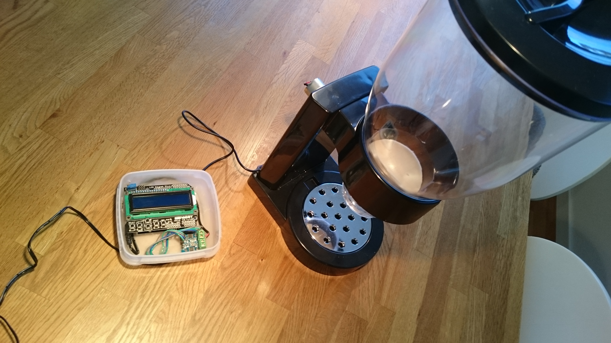
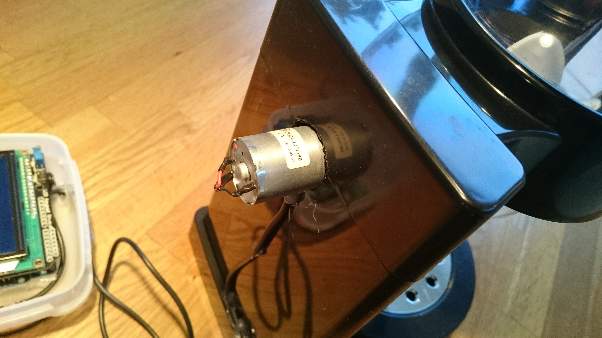
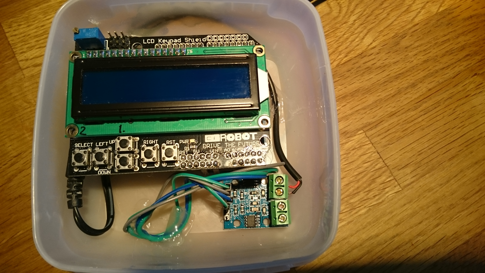

# oats_dispenser
Arduino based dispenser for oats

Hardware:
* Arduino UNO
* LCD Keypad shield
* High torque DC motor, 12rpm, 12V, 4mm shaft (avoid the N20 motors, they are to weak)
* L9110 H-bridge Motor Driver (search for it in ebay!)
* Cereal dispenser ([picture](images/dispenser.jpg), search for e.g. PASTA CEREAL DISPENSER DRY FOOD STORAGE CONTAINER DISPENSE MACHINE)
* Connection wires

3D-printed:
* Shaft adapter

Assembly:

1. Remove the turning knob and shaft from the dispenser. Remove the slotted cog-wheel. Let the clear plastic container be in place, in the stand. Keep the turning knob for emergencies!

2. Put a very long 6mm drill through the hole of the shaft. Drill through the stand, this is the hole where the motor will be mounted.

3. On the back side of the stand make the hole bigger, around 25mm diameter, and make small wholes for the screws in the inner wall. These screws will fix the motor position during operation. Wait with mounting of the motor. .

4. Print the shaft adapter.

5. Put the cog-wheel back but with the shaft pointing towards the back instead of the front. Wiggle the container in position, put the adapter on the cog-wheel shaft and put the motor shaft in the other end of the adapter.![Shaft adapter from other angle] (images/shaft_adapter_other_angle.JPG)

6. Use screws to fix the motor in position. Screws are visible here: ![Shaft adapter] (images/shaft_adapter_in_place.JPG)

7. Assemble arduino and shield, connect motor driver and motor, see code for pin numbers. 

Usage:

1. Use up and down button to select number of portions.

2. Push select to dispense. 

Notes:
* Variations in motor voltage and RPM can be handled in the code, it is sufficient torque that is important.

TODO:

1. Fix nice box for arduino and shield.
